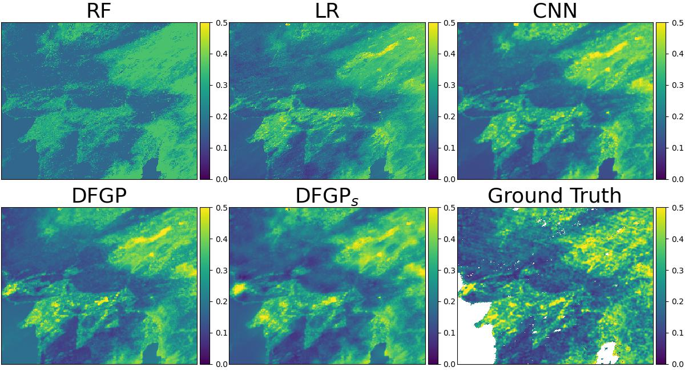

# Deep Feature Gaussian Processes for Single-Scene Aerosol Optical Depth Reconstruction
[Shengjie Liu](https://skrisliu.com), [Lu Zhang](https://luzhangstat.github.io/)

University of Southern California

This is a GitHub repo at [https://github.com/skrisliu/dfgp](https://github.com/skrisliu/dfgp)

## Key Packages
	pytorch==2.0.1
	gpytorch==1.11

Tested on Python 3.9, Ubuntu 18.04.6 LTS, with 1080 Ti 11GB GPU. Running on CPU is possible but significantly slow. 

This repo includes the MODIS-LA data, with trained CNN network and deep features. For the EMIT-BJ data, download at [Google Drive](https://drive.google.com/file/d/1BTZcS3HGaDS1ROhEObQK30LHvVZ3qesx/view?usp=drive_link). 

## Demo on MODIS-LA
	data/modis/im.npy         # features, 240*300*13, the last two dimensions are xy coordinates
	data/modis/aod.npy        # label, 240*300
	data/modis/trainmask.npy  # train mask, 240*300
	data/modis/testmask.npy   # test mask, 240*300
	data/modis/fea64.npy      # deep features, 240*300*64
	data/modis/cnn.pt         # trained CNN model

Data required to run the MODIS-LA demo are included in this repo.

### DFGP
	Python demo12_modis_dfgp.py

### DFGPs
	Python demo12_modis_dfgps.py

### Baseline Methods
###### CNN 
	Python demo11_modis_cnn.py

Require *networks.py* and *rscls.py* to clip the image and load network

